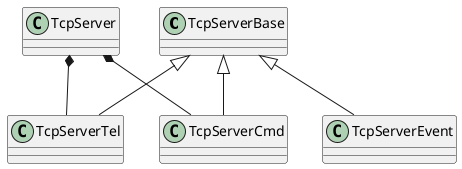
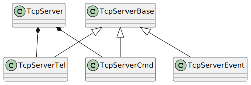

# PlantUML and Markdown Integration on GitHub repository

This project is to find a way to programmatically update a diagram generated by PlantUML script in a markdown file.

# Tcp Server Communication Diagram

The Communication Diagram shows how internal objects interact in **TcpServer** top-level class, along with messages that travel from one to another.

Set `plantuml:{filename}` as a fence information. `filename` is used as the file name of generated diagrams. In the following case, `md-sample-sequence.svg` is created.
`filename` is required.

**TcpServerCmd** is the class that handles commands and events.
**TcpServerTel** is the class that handles telemetry messages.
Both are part of the **TcpServer** class.
